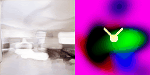
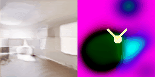
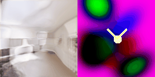
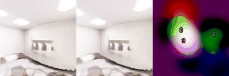
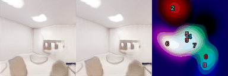
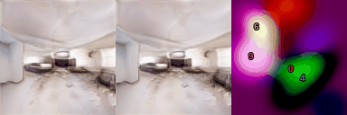
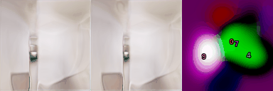
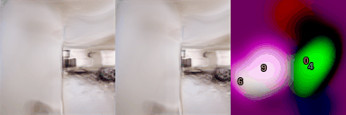

## BlobGSN: Generative Scene Networks with Mid-Level Blob Representations
**Unconstrained Scene Generation with Locally Conditioned Radiance Fields and Mid-Level Blob Representations**<br>
Allen Zhang, David Fang, Ilona Demler<br>

### [Project Page](https://ilonadem.github.io/blobgsn-demo/) | [Data](#datasets)

## Abstract 
We combined BlobGAN with Generative Scene Networks to generate editable 3D scenes. Namely, we use Gaussian "blobs" as input to generating a 2-D floorplan that is then used to locally condition a radiance field. The Gaussian blobs represent objects in a scene; by moving, shifting, scaling, removing, and adding the blobs in the latent space we are able to make corresponding changes in the rendered images. The result is a customizable and editable 3D scene, and a self-suprevised way of identifying and representing the objects in it.


## Related Work
There has been much progress in the last few years in the field of scene representation and reconstruction recently with the advent of NeRFs and other similar architectures. 

### Neural Radiance Fields (NeRFs)
Neural radiance fields (NeRFs) and its variations are fully connected neural networks that can generate novel views of complex 3D scenes based on a set of input 2D images. Many derivatives exist with varying capabilities, such as Mip-NeRF and PixelNeRF, that provide advantages such as faster rendering speed, better novel view synthesis, or requiring less input images.

### Generative Scene Networks (GSN)
GSN is a generative model that learns to create novel indoor scenes. It relies on generating a local latent scene floorplan from a global latent code in order to locally condition NeRFs, which are then used to render images. This local latent floorplan essentially decomposes the scene from one large radiance field into many smaller local radiance fields. GSN learns a scene prior that the paper argues can be trained on multiple datasets and then recycled for other tasks, like generating new scenes or scene auto-complete. Their underlying generator/discriminator architecture is based on StyleGAN2.

### BlobGAN
BlobGAN presents an unsupervised way to train a mid-level representation for a generative model of scenes. Scenes are modeled as a collection of spatial, alpha-composited “blobs” of features which are placed onto a feature grid and then decoded into an image by a GAN (such as StyleGAN2). The blob parameters encode the position, size, and style of each “entity” in the scene. In experiments, researchers find that editing blobs in the latent space corresponds to edits in the rendered output. Their underlying generator/discriminator architecture is also based off of StyleGAN2.

## Motivation
Current 3D representation research mainly focuses on single isolated objects, such as faces, simple cars, mugs, or small uncluttered scenes. Scenes on the scales of rooms, streets, and cityscapes are only now starting to gain interest in this field, along with a variety of NeRF derivatives used to represent them. However, GANs in this space are still uncommon, as creating novel 3D scenes on this scale is difficult. With a combined GSN and BlobGAN model, we hope to couple the mid-scale room generation of GSN with the scene editing capabilities of BlobGAN, and possibly expand to larger-scale scenes.

A model that achieves our goals would allow for a variety of uses. Considering the hype around GANs such as DALL-E and Stable Diffusion, it could be used for generative art in the form of customizable 3D rooms. Our model could also possibly be applied large-scale scenes such as streets and cities, although we predict that this will be quite difficult. The most important application however could be scene understanding. If our blobs can represent objects in a room, that would mean that our model is capable of self-supervised object discovery in 3D scenes, which could be useful in downstream applications such as autonomous vehicles.

## Proposed Architecture
We propose using the output from the BlobGAN generator as the input latent floorplan for GSN. We hope that the model learns a correspondence between blobs in the floorplan and actual rendered entities, whether that be rooms, walls, or smaller objects such as couches and tables. The discriminator remains the same from GSN (which is also based off StyleGAN so it should also be similar to the BlobGAN discriminator). BlobGAN and GSN both use similar GAN architectures, which we predict will allow them to work well together in combination.

 

## Results
These results are from a model trained for 2 days on the Replica dataset with a batch size of 4 and 10 blobs.

### Scene Walkthroughs

For the following walkthroughs, we sampled 5 random scenes (without cherry picking) and mapped a trajectory through the scene. We used the nerf ray sampling function to draw an agent that walks on top of the blob representation with two lines to denote its FOV. From this representation, one can see that the blobs represent different rooms, styles or sections of the scene.

<p align="center" display="inline-block" >
  
  
  
  
  
  <br>
  Walking through five random scenes
  <br>
  &nbsp; <br>

  
  <br>
  The walls of the scene correspond to boundaries of the blob.
  &nbsp;
  <br>
  <br>

  
  <br>
  Different blobs = different styles
  &nbsp; <br>

</p> 
However, it appears that blobs don't necessarily represent recognizable objects or sections of the scene.

<p align="center">
  
  <br>
  In this scene, the upper left and bottom right green blobs seem to correspond to areas that aren't recognizable rooms or features, unlike the other central blobs
</p> 

### Blob Editing

With our blob representation, we can edit blobs in the forms of moving, resizing, adding, removing, and rotating blobs. Such edits lead to changes in the scene. In our case, we hypothesize that these blobs represent large-scale objects such as rooms and walls. Thus, when we move blobs, we can see walls and even whole rooms moving in our scene.

<p align="center">
  
 <br>
  Moving a blob towards the camera.
 <br>
 &nbsp; <br>
 
 <br>
  Moving a blob away from the camera.
  <br>
 &nbsp; <br>
 
 <br>
  Moving a blob to the left of the camera.
  <br>
 &nbsp; <br>
 
 <br>
  Moving a blob to the right of the camera.
</p>

We can manipulate multiple blobs at the same time and resize blobs to make their objects more prominent. For example, we can effectively spawn in a blob to "create" a new wall/room in the scene.

<p align="center">
  
 <br>
  Moving two blobs at the same time.
 <br>
 &nbsp; <br>
 
 <br>
  Spawning a blob in the middle of the scene.
</p>

## Limitations and Future Work
These results are quite exciting, but there are several future avenues of investigations that would be interesting. The first would be to perturb our blobs during training, which produced favorable results in the BlobGAN paper, and we anticipate might improve things in our case as well. Additionally, we note that the trained blobs end up being roughly the same size as the rooms themselves; we expect that increasing the amount of blobs will result in blobs that represent objects within the rooms themselves.

Another interesting investigation would be sizes other than gaussian blobs. Most objects in the room are not spherical, but the circular nature of this mid-level representation sometimes results in circular room artifacts. It would be interesting to see what training on n-gons or rectangles might look like. Additionally, considering a tri-plane structure (three ground plans) or 3D Gaussian Blobs might ipmprove the model further. InstantNGP and TensoRF also present new paradigms of model training that are much faster and comparably convergent, which would also be promising as a substitute for the MiP NeRF currently used in BlobGSN.

The results above are from the Replica dataset, which is relatively small (~18 scenes), and it would be interesting to train the model on bigger and more diverse scenes in which there is more variety in objects and scales. The immedeate next step for this would be testing on a Boston Dataset generated using GoogleEarth Studio. 

An interesting extension of this work would be to examine what the blobs are learning further, and even explore the question of what sort of blobs could be learned from a pre-trained nerf (inverse BlobGSN). The mid-level nature of the blob representation also opens up exciting questions in the realm of suprevised learning -- the blobs learn to identify and represent objects on their own without any human supervision.

## Datasets
We use the Replica and Vizdoom datasets provided by the Generative Scene Networks authors. They contain scenes and sequences of rgb and depths frames, along with camera parameters.

Dataset | Size | Download Link
--- | :---: | :---:
Vizdoom | 2.4 GB | [download](<https://docs-assets.developer.apple.com/ml-research/datasets/gsn/vizdoom.zip>)
Replica | 11.0 GB | [download](<https://docs-assets.developer.apple.com/ml-research/datasets/gsn/replica.zip>)

Datasets can be downloaded by running the following scripts:  
**VizDoom**<br>
```
python scripts/download_vizdoom.py
```
**Replica**<br>
```
python scripts/download_replica.py
```

## Code Acknowledgements
Our code builds off of existing work:
- [BlobGAN](https://github.com/dave-epstein/blobgan)
- [Generative Scene Networks](https://apple.github.io/ml-gsn/)
