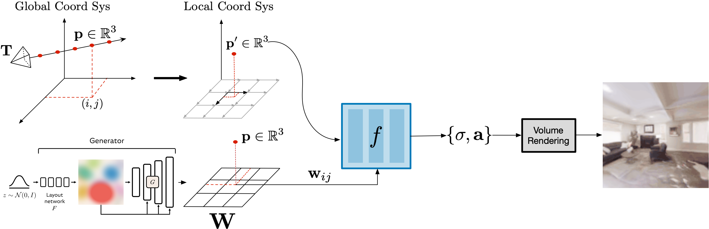

## BlobGSN: Generative Scene Networks with Mid-Level Blob Representations
**Unconstrained Scene Generation with Locally Conditioned Radiance Fields and Mid-Level Blob Representations**<br>
Allen Zhang, David Fang, Ilona Demler<br>

### [Project Page](https://ilonadem.github.io/blobgsn-demo/) | [Data](#datasets)

## Abstract 
We combined BlobGAN with Generative Scene Networks to generate editable 3D scenes. Namely, we use Gaussian "blobs" as input to generating a 2-D floorplan that is then used to locally condition a radiance field that represents a 3D scene. The Gaussian blobs represent objects in a scene; by moving, shifting, scaling, removing, and adding the blobs in the latent space we are able to make corresponding changes in the rendered scene. The result is a customizable and editable 3D scene, and a self-suprevised way of identifying and representing the objects in a scene.

## Motivation

## Related Work

## Proposed Architecture

 

## Results

### Scene Walkthroughs

### Blob Editing

With our blob representation, we can edit blobs in the forms of moving, resizing, adding, removing, and rotating blobs. Such edits leads to changes in the scene. In our case, we hypothesize that these blobs represent large-scale objects such as rooms and walls. Thus, when we move blobs, we can see walls and even whole rooms moving in our scene.

<p align="center">
  
 <br>
  Moving a blob towards the camera.
 <br>
 &nbsp; <br>
 
 <br>
  Moving a blob away from the camera.
  <br>
 &nbsp; <br>
 
 <br>
  Moving a blob to the left of the camera.
  <br>
 &nbsp; <br>
 
 <br>
  Moving a blob to the right of the camera.
</p>

We can manipulate multiple blobs at the same time and resize blobs to make their objects more prominent. For example, we can effectively spawn in a blob to "create" a new wall/room in the scene.

<p align="center">
  
 <br>
  Moving two blobs at the same time.
 <br>
 &nbsp; <br>
 
 <br>
  Spawning a blob in the middle of the scene.
</p>

## Datasets
We provide camera trajectories for two datasets that we used to trained our model: Vizdoom and Replica. These datasets are composed of different sequences with corresponding rgb+depth frames and camera parameters (extrinsiscs and intrinsics).

Dataset | Size | Download Link
--- | :---: | :---:
Vizdoom | 2.4 GB | [download](<https://docs-assets.developer.apple.com/ml-research/datasets/gsn/vizdoom.zip>)
Replica | 11.0 GB | [download](<https://docs-assets.developer.apple.com/ml-research/datasets/gsn/replica.zip>)

Datasets can be downloaded by running the following scripts:  
**VizDoom**<br>
```
python scripts/download_vizdoom.py
```
**Replica**<br>
```
python scripts/download_replica.py
```

## Code Acknowledgements
Our code builds off of existing work:
- [BlobGAN](https://github.com/dave-epstein/blobgan)
- [Generative Scene Networks](https://apple.github.io/ml-gsn/)
